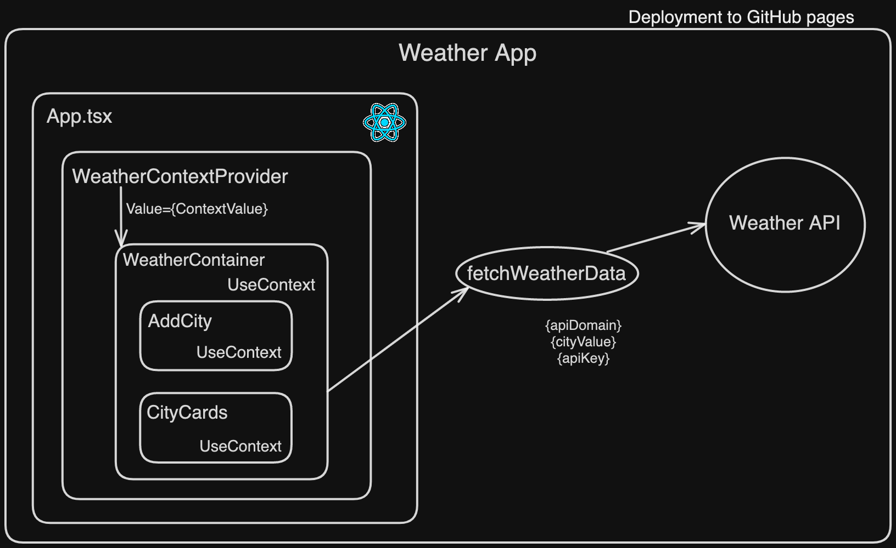
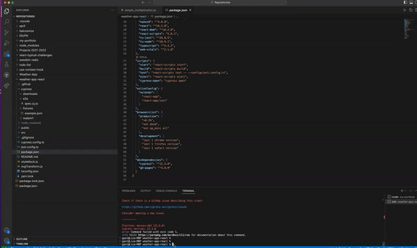

# `Weather-App`

With this app you can check the weather in any city in the world. The icons in the Weather app indicate different weather conditions.

Life App is here: https://elizpn.github.io/Weather-App-React/

-  Language - [TypeScript](https://www.typescriptlang.org/)
-  Data storage - React Context
-  Client Framework - [React](https://reactjs.org)
-  Unit testing - [Jest](https://jestjs.io), [React Testing Library](https://testing-library.com)
-  E2E testing - [Cypress](https://www.cypress.io/)
-  Styles - [Material UI](https://mui.com/) 

## Architecture: 

# Demo desctop version: 

# Demo mobile version: 

# Demo cypress testing: 

